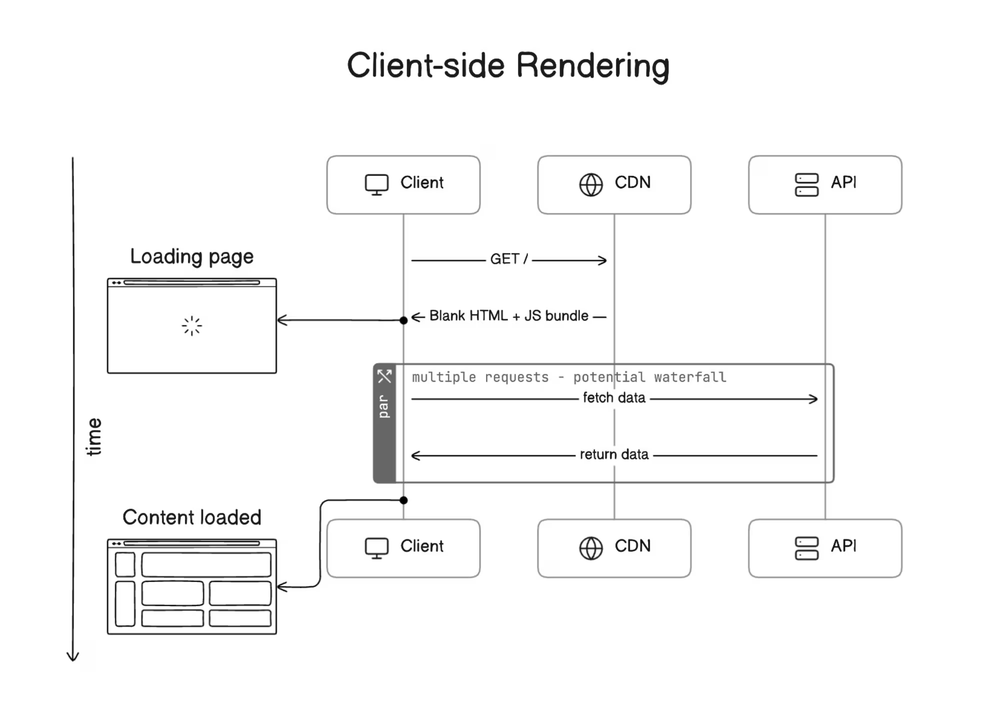
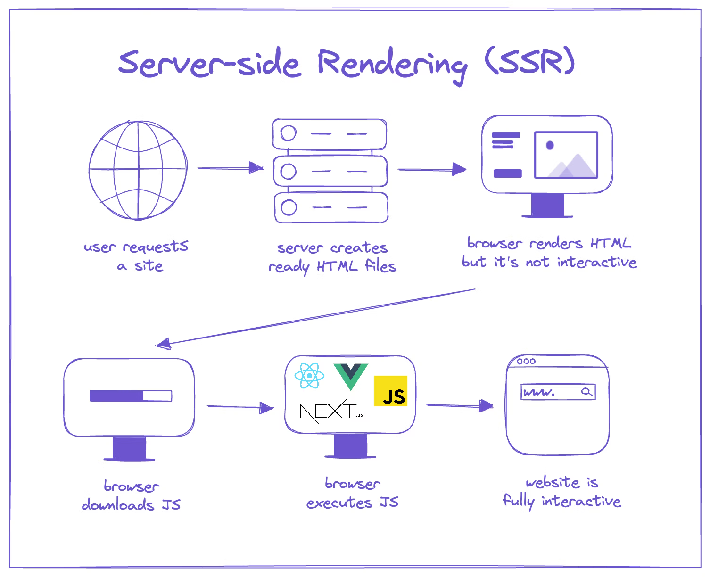

## 🟢 What is **Client-Side Rendering (CSR)**?

**Client-Side Rendering** is a rendering strategy where **the browser** is responsible for generating the content of the web page using **JavaScript**. That means:

1. The initial HTML sent from the server is usually **minimal or empty**, just a shell.
2. Once the browser loads the page, it downloads the **JavaScript bundle**.
3. That JavaScript then:
   - Fetches any data (via APIs),
   - Builds the UI using React (or other frameworks),
   - And injects it into the DOM (using something like `ReactDOM.hydrate()`).

---

### 🔁 Flow of CSR

```
Browser -> HTTP Request --> Server --> Returns HTML Shell
         -> Loads JS bundle --> Executes React Code --> Fetches data --> Renders UI
```

---

## 🧩 Example in Next.js

In **Next.js 13+ App Router**, any component that uses `"use client"` at the top is rendered on the **client**:

```tsx
// app/dashboard/page.tsx
"use client"; // 👈 This triggers CSR

import { useEffect, useState } from "react";

export default function Dashboard() {
  const [data, setData] = useState([]);

  useEffect(() => {
    fetch("/api/stats")
      .then(res => res.json())
      .then(data => setData(data));
  }, []);

  return <div>{data.length > 0 ? "Data Loaded" : "Loading..."}</div>;
}
```

Here, nothing happens on the server — everything is fetched and rendered in the browser **after the page loads**.

---

## ✅ Benefits of CSR

| Advantage                    | Description |
|-----------------------------|-------------|
| 🔄 **Rich Interactivity**    | Great for dynamic UIs, dashboards, apps like Gmail, Trello, etc. |
| 📦 **Reduced Server Load**   | Server just sends static shell + JS; everything else is browser-side |
| 🧠 **Great Dev Experience**  | Feels like building a SPA (Single Page App) |
| 📡 **API-Based Architecture**| Works well with backend APIs or headless CMS |

---

## ❌ Drawbacks of CSR

Let’s go into some **real-world concerns**:

### 1. ❌ **Slower Initial Page Load**
- Since the actual content is generated **after JS loads**, the user initially sees a blank screen or spinner.
- Especially bad on **slow connections or old devices**.

### 2. ❌ **Poor SEO**
- Search engines prefer pages with pre-rendered content.
- CSR pages are hard to index unless extra tools (like dynamic rendering or SSR fallback) are used.

### 3. ❌ **JavaScript Dependency**
- If JS is disabled or fails to load => Blank page.
- Your whole UI is locked behind a JS barrier.

### 4. ❌ **Larger Bundle Size**
- Everything must be sent to the client — UI logic, routing, state management.
- Can lead to longer **Time to Interactive (TTI)**.

### 5. ❌ **Worse Performance on Mobile**
- Client does all the work — fetching, parsing, rendering, animating.
- Bad for low-end or older mobile devices.

---

## 🔥 Real-World Use Cases (When CSR is Ideal)

- **Dashboards** or internal tools
- **Web apps** with lots of user interaction
- **Authenticated pages** where SEO doesn’t matter
- **Single Page Apps (SPA)**

---

## 📌 Quick Comparison

| Strategy     | Rendered On     | SEO Friendly | Fast First Load | Dynamic |
|--------------|------------------|---------------|------------------|----------|
| CSR          | Browser          | ❌ No          | ❌ No             | ✅ Yes   |
| SSR (Server-Side) | Server       | ✅ Yes         | ✅ Yes            | ✅ Yes   |
| SSG (Static) | At Build Time    | ✅ Yes         | ✅ Yes            | ❌ No    |

---

## 🧠 Best Practices in CSR (If You Must Use It)

- Use `Suspense` and `loading` states well
- Optimize JS bundles (code-splitting)
- Load critical data as early as possible
- Avoid heavy logic in components
- Use lazy-loading for non-critical parts

---

## 🤔 CSR in Next.js 15: How to Control It

- Use `"use client"` to **force client-side rendering**
- Don't use server-only features like `fetch()`, `headers()`, or `cookies()` from `next/headers`
- Use `useEffect()` for browser-only logic
- Use `<Suspense>` to handle loading states well

---

## 🧠 What is **Server-Side Rendering (SSR)**?

**Server-Side Rendering** means the **HTML content** of a page is **generated on the server** **for every incoming request**, **before** it’s sent to the browser.

> 🧾 Unlike CSR (Client-Side Rendering), where the browser builds the UI using JavaScript **after** page load, **SSR delivers a fully populated HTML page right away.**

---

### 📦 Basic Flow of SSR

```
User visits page ➜ Server receives request ➜
Runs React code + fetches data ➜
Generates full HTML ➜ Sends it to browser
```

---

## 🧩 SSR in Next.js 15 (App Router)

In **Next.js 13+ (including 15)**, **SSR is the default** for most server components.

Here's an example:

### ✅ Server Component Example

```tsx
// app/products/page.tsx
import React from "react";

export default async function ProductsPage() {
  const res = await fetch("https://api.example.com/products", {
    cache: "no-store", // SSR: don't cache, always render fresh
  });
  const products = await res.json();

  return (
    <div>
      <h1>All Products</h1>
      <ul>
        {products.map(p => (
          <li key={p.id}>{p.name}</li>
        ))}
      </ul>
    </div>
  );
}
```

> ✅ This page is rendered **fresh from the server** on **every request** because of `cache: "no-store"`.

---

### 🤔 How to Force SSR in Next.js?

There are two main ways:

1. **Use a Server Component** (default in App Router)
2. **Set `cache: "no-store"`** or `dynamic = "force-dynamic"` (in route handlers or pages)

---

## ✅ Advantages of SSR

| Benefit                        | Description |
|-------------------------------|-------------|
| ⚡ **Fast First Load**         | Since server sends fully rendered HTML, browser can show content **immediately**. |
| 🔍 **SEO Friendly**            | Search engine crawlers can index the page easily because the content is already rendered. |
| 🔄 **Always Fresh Data**       | Since data is fetched per request, you're always serving the latest info. |
| 🔐 **Better for Auth Pages**   | You can use secure cookies or headers during request to tailor the response. |
| 📉 **Reduced Client JS Load**  | Since rendering happens on server, client JS bundle can be smaller. |
| 📱 **Good for Slower Devices** | Less work on the client = better performance on low-end mobile devices. |

---

## 🛑 Tradeoffs of SSR

| Drawback                      | Description |
|------------------------------|-------------|
| 🐢 **Slightly Slower TTFB**   | Since HTML is generated on demand, there's a delay before the page starts loading. |
| 🧮 **Higher Server Load**     | Every request hits the server — bad for very high-traffic pages without caching. |
| ❌ **No Offline Access**      | Unlike static pages, you can’t cache or pre-render SSR pages for offline use easily. |

---

## 🔀 SSR vs CSR vs SSG

| Feature              | SSR                       | CSR                       | SSG                          |
|----------------------|---------------------------|---------------------------|------------------------------|
| First Load Speed     | ⚠️ Moderate                | ❌ Slow                    | ✅ Fast                      |
| SEO Ready            | ✅ Yes                     | ❌ No                      | ✅ Yes                       |
| Data Freshness       | ✅ Always Fresh            | ✅ Depends on fetch        | ❌ Only at build time        |
| Server Load          | ⚠️ High                    | ✅ Low                     | ✅ None at runtime           |
| Complexity           | ⚠️ Medium                  | ✅ Easy                    | ✅ Medium                    |

---

## 🧪 How to Test SSR in Next.js 15

You can verify SSR by:

1. Turning off JavaScript in the browser (View → Developer → Dev Tools → Network → Disable JS).
2. Refresh the page. If content still loads — it’s rendered on the server (SSR ✅).

---

## 👨‍🏫 When Should We Use SSR?

Use SSR if:
- Content changes frequently and needs to stay up-to-date.
- The page is **public** and needs good SEO.
- You want to use **secure request headers/cookies** to personalize content.
- You don’t want users to wait for a JS bundle to load before seeing content.

---

## ✅ Summary

| Topic                   | Summary |
|-------------------------|---------|
| **What**                | Rendering HTML on the server, for every request |
| **How**                 | Use `fetch()` with `cache: "no-store"` or `force-dynamic` |
| **Best For**            | SEO-heavy pages, authenticated pages, dynamic content |
| **Tools Used**          | Server Components, `fetch()`, route handlers |

---

Let’s compare **Client-Side Rendering (CSR)** vs **Server-Side Rendering (SSR)** in **Next.js 15** — with real-world scenarios, benefits, and tradeoffs — so we have clarity on **when to use which**.

---

## 🔥 CSR vs SSR: The Big Picture

| Feature                     | **CSR (Client-Side Rendering)**                                 | **SSR (Server-Side Rendering)**                                 |
|----------------------------|------------------------------------------------------------------|------------------------------------------------------------------|
| **Where HTML is generated**| In the **browser** after JS loads                                | On the **server**, per request                                  |
| **Initial Page Load**      | Slow (empty page + JS fetch + render)                           | Fast (HTML is ready from the start)                            |
| **SEO**                    | Poor (HTML is empty initially, bad for bots)                    | Excellent (HTML is pre-filled for crawlers)                    |
| **Data Freshness**         | Fetches latest data from client                                 | Always fresh on each request                                   |
| **Performance on slow devices** | Slower, since rendering happens in browser                  | Faster, as rendering offloaded to server                       |
| **JavaScript Dependency**  | ❗ High (won’t work without JS)                                 | Lower (basic page shows even without JS)                       |
| **Server Load**            | Low (no render logic on server)                                | High (each request renders the page)                           |
| **Caching Possibility**    | Client-controlled or with SW                                   | Server + CDN caching possible                                  |
| **Offline Support**        | Easy to implement with service workers                          | Harder without extra setup                                     |

---

## 🛠️ Code-Level Comparison (Next.js 15)

### ✅ CSR Example

```tsx
// app/products/page.tsx
'use client'

import { useEffect, useState } from "react";

export default function ProductsPage() {
  const [products, setProducts] = useState([]);

  useEffect(() => {
    fetch("/api/products") // API call only in the browser
      .then(res => res.json())
      .then(data => setProducts(data));
  }, []);

  return (
    <div>
      <h1>Client Side Products</h1>
      <ul>{products.map(p => <li key={p.id}>{p.name}</li>)}</ul>
    </div>
  );
}
```

> 🟡 **HTML is blank** on first load — content appears **after** JS runs.

---

### ✅ SSR Example

```tsx
// app/products/page.tsx (Server Component)
export default async function ProductsPage() {
  const res = await fetch("https://api.example.com/products", {
    cache: "no-store" // SSR
  });
  const products = await res.json();

  return (
    <div>
      <h1>Server Side Products</h1>
      <ul>{products.map(p => <li key={p.id}>{p.name}</li>)}</ul>
    </div>
  );
}
```

> 🟢 HTML already contains product data on load — **great for SEO & UX**.

---

## 💡 Real-World Use Cases

| Scenario                           | Best Rendering Strategy        | Why? |
|-----------------------------------|-------------------------------|------|
| 🔎 Blog or News Article           | **SSR** or **SSG**            | SEO & dynamic content |
| 🛍️ Product Listings               | **SSR**                       | Fresh data & SEO |
| 📱 Dashboard after login          | **CSR**                       | Private, user-specific |
| ⚙️ Settings/Profile Page          | **CSR**                       | Auth required, no SEO |
| 🧾 E-commerce Checkout            | **CSR**                       | Secure, dynamic |
| 🧭 Landing Page                   | **SSG** (or SSR for A/B tests)| Fast & SEO |

---

## 🟡 Hybrid Strategy

Next.js 15 makes it easy to **mix CSR and SSR** in the same app:

- Use **Server Components** by default (SSR/SSG)
- Add `use client` to opt into **CSR** for interactivity

Example:

```tsx
// app/products/[id]/page.tsx (Server Component for SSR)
import ProductDetails from "./ProductDetails";

export default async function Page({ params }) {
  const data = await fetchProduct(params.id);
  return <ProductDetails data={data} />;
}
```

```tsx
// app/products/[id]/ProductDetails.tsx (Client Component)
'use client'

export default function ProductDetails({ data }) {
  const [qty, setQty] = useState(1);
  return (
    <div>
      <h1>{data.name}</h1>
      <button onClick={() => setQty(qty + 1)}>Add to Cart ({qty})</button>
    </div>
  );
}
```

---

## ✅ Summary Table

| 🔍 Feature         | CSR                                  | SSR                                  |
|-------------------|---------------------------------------|--------------------------------------|
| **Best For**       | Auth dashboards, UIs, interactivity   | SEO, public pages, fresh content     |
| **SEO**            | ❌ Poor unless enhanced with SSR      | ✅ Excellent                         |
| **First Load UX**  | ❌ Blank screen + spinner             | ✅ Ready HTML                        |
| **Server Load**    | ✅ Low                                | ❌ High                              |
| **JS Dependency**  | High                                  | Lower                                |

---
While **Server-Side Rendering (SSR)** in Next.js (including v15) offers powerful benefits like SEO and performance for the *initial* load, it’s not always the best fit for every scenario.

Let’s break down the **drawbacks of SSR** in detail:

---

## 🧨 Drawbacks of Server-Side Rendering (SSR)

---

### 1. **🚦 Slower Time-to-First-Byte (TTFB)**
- Since the server must generate HTML on **every request**, it takes more time before the browser even receives the page.
- This adds latency especially for users far from the server or if server resources are limited.

> 🔴 *Compared to CSR or SSG, SSR pages can take longer to appear, especially on slower networks.*

---

### 2. **⚠️ High Server Load**
- Every user request triggers server-side code execution.
- If your app has **heavy traffic**, SSR can become expensive to scale because rendering isn't cached unless you explicitly implement caching.

> 🧱 *SSG (Static Site Generation) serves pre-built HTML, but SSR builds it for each user — more load.*

---

### 3. **❌ No Out-of-the-Box Offline Support**
- Since SSR pages are dynamically generated, users **can’t access them offline** unless you set up advanced caching strategies or service workers.

> *CSR apps can cache data and views in the browser. SSR can’t unless mixed with client-side logic.*

---

### 4. **🧩 Complicated Data Fetching**
- In SSR, you must ensure all data is fetched **synchronously** and securely on the server.
- If the server has API limits or slowness, it delays the whole page.

> 🐌 *Slow backend → slow HTML render → slow UX.*

---

### 5. **💥 Poor Experience on Page Transitions (without hydration)**
- After the first render, **client-side JS must hydrate** the HTML to make it interactive.
- Hydration is **CPU-intensive** and can cause a **jank or delay**, especially on low-powered devices.

> *That beautiful pre-rendered HTML is just a "screenshot" until hydration finishes.*

---

### 6. **🛑 Can’t Use SSR for Some Client-Specific Features**
- SSR happens **on the server**, so it **has no access** to `window`, `localStorage`, user events, or browser-only APIs.

> 🚫 *SSR pages can’t personalize based on browser info until hydrated or after using cookies/session tokens.*

---

### 7. **📦 Larger Bundle Size**
- To render pages server-side and still hydrate them, SSR apps often include both **server-side logic** and **client-side JS**.
- This can bloat bundles if not optimized with `React.lazy()` and dynamic imports.

---

### 8. **🔐 More Complex Security Handling**
- Since all user requests hit the server, **each one needs to be secured**:
  - Authentication
  - Authorization
  - Rate-limiting
  - Input sanitization

> 🛡️ *Every request is “live” code — not pre-rendered — so SSR increases surface area for security bugs.*

---

### 9. **⚙️ Complicated DevOps Setup**
- You often need a Node.js server running 24/7 to handle SSR — not just a static file host (like Vercel, Netlify, etc. for SSG).
- Might require auto-scaling, CDN integration, and performance monitoring.

> *More moving parts = more room for bugs and failures in production.*

---

### 10. **💸 Higher Hosting Costs**
- SSR requires server resources (CPU, memory) to render and serve every request.
- That can get expensive at scale compared to SSG or pure static hosting.

---

## 🧠 So When Should We Still Use SSR?

SSR is great **if**:

- We **need SEO** + **dynamic data** (e.g., blog, products, public listings).
- Each page request may differ based on user or request params.
- Content changes frequently and must be always fresh.

---

## 🧩 What is Suspense SSR?

**Suspense SSR** is a **React + Next.js rendering model** where components can:

1. **Suspend rendering** while waiting for data (or other async work),
2. Show a fallback (like a loader),
3. **Stream the result** to the browser **as soon as parts are ready** (instead of waiting for the whole page).

This makes SSR **faster**, **smarter**, and **more user-friendly**.

---

## 🚀 How is it Different from Traditional SSR?

|               | 🔄 Traditional SSR          | ⚡ Suspense SSR                |
|---------------|-----------------------------|-------------------------------|
| 🔃 Rendering  | Waits for **everything**     | **Streams** as chunks finish  |
| 💾 Data Fetch | Needs all data **upfront**   | Uses `Suspense` to **defer**  |
| ⌛ UX         | User waits longer            | User sees **partial UI fast** |
| 🧠 Architecture | Monolithic rendering        | Modular + async rendering     |

---

## ⚙️ How Does it Work?

### 1. Components can “suspend” while fetching data
React 18 introduced the ability for components to throw a `Promise`, which `Suspense` can catch and wait on.

```tsx
<Suspense fallback={<Loading />}>
  <UserProfile />
</Suspense>
```

### 2. Next.js uses **React Server Components (RSC)** + Suspense
- Components in the app directory (`app/`) run on the server by default.
- You can suspend parts of the tree and **send HTML to the client as it becomes available**.

### 3. Content is **streamed** using `ReadableStream` (chunked transfer encoding)
- Instead of generating the full HTML and sending it all at once,
- Next.js sends part of the HTML, lets the client **progressively enhance**, and fills in blanks later.

---

## 📦 Real Example:

```tsx
// app/page.tsx

import { Suspense } from "react";
import LatestPosts from "./LatestPosts";
import HeroSection from "./HeroSection";

export default function HomePage() {
  return (
    <main>
      <HeroSection />
      
      <Suspense fallback={<p>Loading latest posts...</p>}>
        <LatestPosts />
      </Suspense>
    </main>
  );
}
```

- `HeroSection` shows immediately.
- `LatestPosts` is a Server Component that might fetch data.
- Browser sees fallback, then HTML updates when posts load.

---

## 🧠 Why is This Powerful?

✅ **Faster Time-To-First-Byte**  
✅ **Progressive rendering**  
✅ **Better performance on slower networks**  
✅ **Built-in support for loading states**  
✅ **Seamless with Server/Client Components in Next.js 15**

---

## 🛑 Caveats

- Requires **React 18+** features.
- Only works in the **App Router (`/app`)**, not the Pages Router (`/pages`).
- You can’t use `Suspense` inside a Client Component to wrap a Server Component.
- Use `Suspense` **carefully**, or it can get complex to manage waterfalls.

---

## ✨ Summary

> **Suspense SSR = smarter, chunked streaming of your React app from server to client, using async-aware components.**

It’s one of the core reasons why Next.js 15 + React 18 is so powerful for modern apps.
---

## 🧠 What are React Server Components (RSC)?

> **React Server Components (RSC)** let us render components **entirely on the server**, with **zero JavaScript sent to the client** — unless needed.

They’re built for performance:  
✅ No bundle size impact  
✅ Access to backend resources directly  
✅ Run **only on the server**

---

## 🔥 Why Were RSC Introduced?

Traditional React components (before RSC):
- Are either rendered fully on the **server** (SSR) OR fully on the **client** (CSR).
- Even in SSR, the component code is eventually sent to the browser and hydrated.

With RSC:
- The component **never reaches the client** unless explicitly needed.
- You get all the benefits of SSR **without sending unnecessary JS** to the browser.

---

## 💡 Key Concepts of RSC

| Feature                     | Explanation                                                                 |
|----------------------------|-----------------------------------------------------------------------------|
| `Server Component`         | Runs only on the server, never shipped to the browser.                      |
| `Client Component`         | Runs in the browser, includes interactivity (like state, effects).         |
| `use client` directive     | Placed at the top of a file to mark it as a client component.               |
| No JavaScript on client    | Server Components aren’t part of the JS bundle sent to the browser.        |
| Built-in in Next.js App Router | Next.js App Directory uses RSC by default for all components.              |

---

## 🔧 Basic Example

```tsx
// app/page.tsx (Server Component)

import ProductList from "./ProductList"; // Also a Server Component

export default async function HomePage() {
  const data = await fetch("https://api.example.com/products").then(res => res.json());

  return (
    <main>
      <h1>Our Products</h1>
      <ProductList products={data} />
    </main>
  );
}
```

No `use client` ⇒ This is a **Server Component**  
- Can fetch data directly
- Has zero JS sent to the browser
- Can render other Server or Client components

---

## 🔁 Mixing Server and Client Components

```tsx
// app/components/Counter.tsx
"use client";

import { useState } from "react";

export default function Counter() {
  const [count, setCount] = useState(0);
  return <button onClick={() => setCount(count + 1)}>Clicked {count} times</button>;
}
```

You can use this **Client Component** inside a Server Component:

```tsx
import Counter from "./components/Counter"; // Client Component

export default function Page() {
  return (
    <div>
      <h2>Hello</h2>
      <Counter />
    </div>
  );
}
```

✅ Server Component = data fetching, heavy logic  
✅ Client Component = interactivity, event handlers

---

## 📦 Benefits of Server Components

| Feature                      | Why It Matters                                                  |
|-----------------------------|------------------------------------------------------------------|
| 🧊 Zero client JS           | Less JS = faster load times                                     |
| ⚙️ Direct server access     | Query databases, read files, access secrets (safely)             |
| 🧩 Flexible composition     | Mix server and client logic as needed                           |
| 🔀 Streaming ready          | Works seamlessly with React Suspense + streaming architecture   |
| 💾 Better caching           | Built-in support for fetch caching, revalidation, etc.          |

---

## 🚫 Limitations

- **No `useState`, `useEffect`, or browser-only APIs** in Server Components.
- Server Components **can’t access `window`, `localStorage`, or events**.
- Props passed to Client Components must be serializable (no functions, for example).
- You can’t **wrap a Server Component in a Client Component** (only the other way around).

---

## 🚀 When to Use What?

| Task                          | Use Server Component? | Use Client Component? |
|------------------------------|-----------------------|------------------------|
| Fetching data from DB/API    | ✅ Yes                | 🚫 No (preferably)     |
| Handling UI interactivity    | 🚫 No                 | ✅ Yes                 |
| Accessing cookies/headers    | ✅ Yes                | 🚫 No (use hooks on client) |
| Rendering static content     | ✅ Yes                | 🚫 No                  |

---

## 🧪 Final Thought

React Server Components are like a **supercharged evolution of SSR** — letting us optimize performance by minimizing JS and intelligently splitting what happens where. In **Next.js 15**, we get the full RSC experience automatically through the **App Router**, and it’s a game-changer for modern React apps.

---

## 🧠 What are React Server Components (RSC)?

> **React Server Components (RSC)** let us render components **entirely on the server**, with **zero JavaScript sent to the client** — unless needed.

They’re built for performance:  
✅ No bundle size impact  
✅ Access to backend resources directly  
✅ Run **only on the server**

---

## 🔥 Why Were RSC Introduced?

Traditional React components (before RSC):
- Are either rendered fully on the **server** (SSR) OR fully on the **client** (CSR).
- Even in SSR, the component code is eventually sent to the browser and hydrated.

With RSC:
- The component **never reaches the client** unless explicitly needed.
- You get all the benefits of SSR **without sending unnecessary JS** to the browser.

---

## 💡 Key Concepts of RSC

| Feature                     | Explanation                                                                 |
|----------------------------|-----------------------------------------------------------------------------|
| `Server Component`         | Runs only on the server, never shipped to the browser.                      |
| `Client Component`         | Runs in the browser, includes interactivity (like state, effects).         |
| `use client` directive     | Placed at the top of a file to mark it as a client component.               |
| No JavaScript on client    | Server Components aren’t part of the JS bundle sent to the browser.        |
| Built-in in Next.js App Router | Next.js App Directory uses RSC by default for all components.              |

---

## 🔧 Basic Example

```tsx
// app/page.tsx (Server Component)

import ProductList from "./ProductList"; // Also a Server Component

export default async function HomePage() {
  const data = await fetch("https://api.example.com/products").then(res => res.json());

  return (
    <main>
      <h1>Our Products</h1>
      <ProductList products={data} />
    </main>
  );
}
```

No `use client` ⇒ This is a **Server Component**  
- Can fetch data directly
- Has zero JS sent to the browser
- Can render other Server or Client components

---

## 🔁 Mixing Server and Client Components

```tsx
// app/components/Counter.tsx
"use client";

import { useState } from "react";

export default function Counter() {
  const [count, setCount] = useState(0);
  return <button onClick={() => setCount(count + 1)}>Clicked {count} times</button>;
}
```

You can use this **Client Component** inside a Server Component:

```tsx
import Counter from "./components/Counter"; // Client Component

export default function Page() {
  return (
    <div>
      <h2>Hello</h2>
      <Counter />
    </div>
  );
}
```

✅ Server Component = data fetching, heavy logic  
✅ Client Component = interactivity, event handlers

---

## 📦 Benefits of Server Components

| Feature                      | Why It Matters                                                  |
|-----------------------------|------------------------------------------------------------------|
| 🧊 Zero client JS           | Less JS = faster load times                                     |
| ⚙️ Direct server access     | Query databases, read files, access secrets (safely)             |
| 🧩 Flexible composition     | Mix server and client logic as needed                           |
| 🔀 Streaming ready          | Works seamlessly with React Suspense + streaming architecture   |
| 💾 Better caching           | Built-in support for fetch caching, revalidation, etc.          |

---

## 🚫 Limitations

- **No `useState`, `useEffect`, or browser-only APIs** in Server Components.
- Server Components **can’t access `window`, `localStorage`, or events**.
- Props passed to Client Components must be serializable (no functions, for example).
- You can’t **wrap a Server Component in a Client Component** (only the other way around).

---

## 🚀 When to Use What?

| Task                          | Use Server Component? | Use Client Component? |
|------------------------------|-----------------------|------------------------|
| Fetching data from DB/API    | ✅ Yes                | 🚫 No (preferably)     |
| Handling UI interactivity    | 🚫 No                 | ✅ Yes                 |
| Accessing cookies/headers    | ✅ Yes                | 🚫 No (use hooks on client) |
| Rendering static content     | ✅ Yes                | 🚫 No                  |

---

## 🧪 Final Thought

React Server Components are like a **supercharged evolution of SSR** — letting us optimize performance by minimizing JS and intelligently splitting what happens where. In **Next.js 15**, we get the full RSC experience automatically through the **App Router**, and it’s a game-changer for modern React apps.

---

## 🌱 What is RSC Rendering Lifecycle?

The **RSC rendering lifecycle** refers to the **sequence of events** that occur from the time a request is made (e.g., user visits a page) to the time the fully rendered HTML/React tree is served to the browser — with **Server Components** being evaluated **on the server only**, and **Client Components** rendered/hydrated on the client.

---

## 🔄 Full Lifecycle Overview (Step-by-Step)

Here's a breakdown of how rendering flows in **Next.js 15 using RSC**:

---

### **1. Request Initiated**

- A user visits a route (e.g., `/dashboard`) → triggers a **route match**.
- Next.js starts by resolving the **layout**, **template**, and **page** files.

---

### **2. Server Components Evaluated**

- All components **default to Server Components** unless they have `"use client"` at the top.
- Server Components:
  - Fetch data (e.g., from a DB or API)
  - Build the React tree (on the server)
  - No JavaScript is sent for these components

🧠 These are **never sent to the client**, only their **HTML and React payload** is.

---

### **3. Boundary Identification**

- During render, Next.js identifies **Client Components** inside the tree.
- These boundaries are separated into **islands**.
- For each `"use client"` component:
  - A placeholder is inserted into the HTML
  - Its JavaScript is shipped separately

---

### **4. Streaming Starts (via Flight Protocol)**

- The server starts **streaming the output** of the Server Component tree (as a special format called the **Flight payload**).
- The client (browser) **gradually receives** the HTML and component metadata.

📦 Think of it like progressive hydration: HTML comes first, followed by interactive JS islands.

---

### **5. Client Receives the Page**

- Static content (HTML) is shown immediately — this is the **Server Component part**.
- Next.js loads the JS bundle for each Client Component.
- Each island gets **hydrated** (interactivity enabled) using React.

This is where `useState`, `useEffect`, `onClick`, etc., start to work.

---

### **6. Interactions Begin (Client Only)**

Once hydration is complete:
- UI becomes interactive
- Further interactions (clicks, inputs) are handled by **Client Components**
- Server Components don’t re-run unless we navigate away or fetch new data

---

## 🚨 Key Characteristics of RSC Lifecycle

| Phase                 | Location | Can Use Browser APIs | Sends JS to Client | Can Fetch Data |
|----------------------|----------|----------------------|--------------------|----------------|
| Initial Render        | Server   | ❌ No                | ❌ No              | ✅ Yes         |
| Client Hydration      | Client   | ✅ Yes               | ✅ Yes             | ⚠️ Only via API |
| Updates (Navigation) | Server/Client | Depends          | Depends            | Depends        |

---

## 🎨 Visual Representation (Simplified)

```plaintext
User Requests Page
        ↓
Match Route Layout/Template/Page
        ↓
Run Server Components
        ↓
Detect Client Component Boundaries
        ↓
Stream HTML + Metadata (Flight)
        ↓
Client Loads Page
        ↓
Hydrate Client Components
        ↓
Interactive Page Ready
```

---

## ✅ Benefits of This Lifecycle

- ⚡ **Faster initial page load** (less JS sent)
- 🧼 **Better separation of concerns** (data-fetching vs interactivity)
- 🔐 **Security**: server-side logic stays hidden
- 🧩 **Composable**: use both Server and Client components

---

## 🧪 When Does This Lifecycle Re-run?

- On **initial page load**
- On **navigation to a new route** (if not cached)
- On **fetching new data using server actions or route handlers**

---

## ✨ Bonus Tip: Server Actions

In Next.js 15, **Server Actions** can also trigger a partial re-run of this lifecycle. When a Server Action runs:
- The Server Component (or specific subtree) is **re-evaluated**
- The updated state is streamed to the client without full reload

---

## Summary Table

| Aspect                      | Server Component                     | Client Component                      |
|----------------------------|--------------------------------------|----------------------------------------|
| Rendered Where?            | On the server                        | On the client                          |
| Uses `"use client"`?       | ❌ No (default)                      | ✅ Yes                                 |
| Can fetch data?            | ✅ Yes (directly)                    | ⚠️ Indirectly (via API calls)          |
| JavaScript sent to client? | ❌ No                                | ✅ Yes                                 |
| Lifecycle Events           | Evaluated once per request           | React hooks like `useEffect` apply     |
| Interactivity              | ❌ No                                | ✅ Yes                                 |

---


